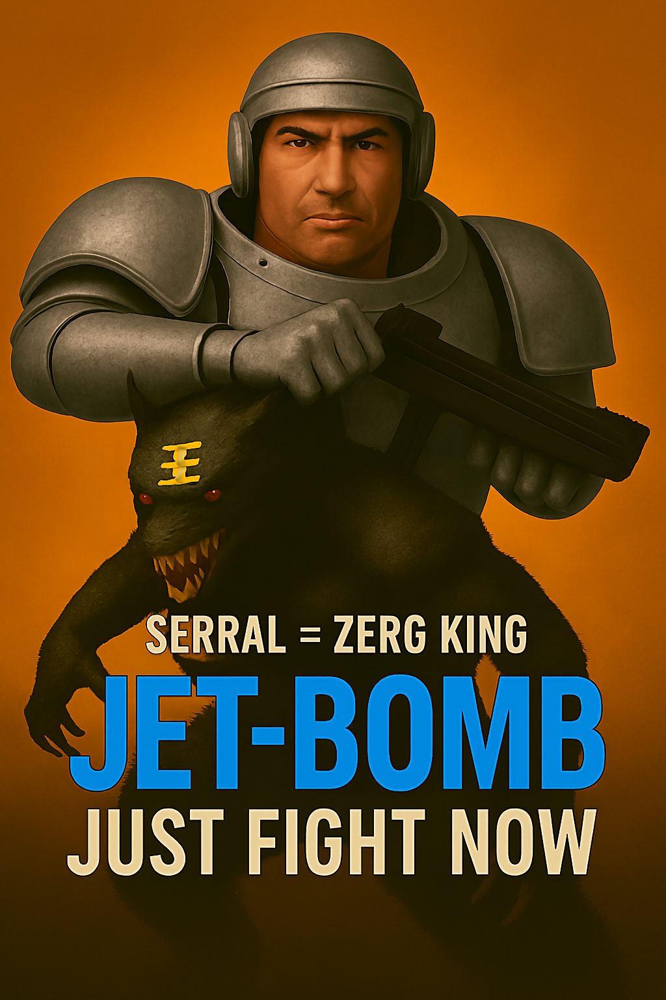

星海爭霸0500戰術，聽命或被殺？

傑邦就是JET-BOMB

星海誰最能打, 是Serral？

  

    
    
點擊聽命：空投不是選擇，是命令。

    <audio id="voice1" src="assets/audio/tank_drop_story.mp3"></audio>
  

  

    
    
點擊聽命：七分鐘不是預估，是限制。

    <audio id="voice2" src="assets/audio/win_7min_story.mp3"></audio>
  

  

    
    
點擊聽命：門不是防線，是壓制起點。

    <audio id="voice3" src="assets/audio/fight_door_story.mp3"></audio>
  

0500空降演示，你不是在觀看，你正在被鎖定。

  

    
    
點擊聽命：0500空降已上線，掃描或死。

    <audio id="voice4" src="assets/audio/angelababy_drop_command.mp3"></audio>
  

  

    
    
點擊進入：SC2_Terran_0500Drop_v1.mp4

  

  

    
    
掃描進入：0500空降模組

  

