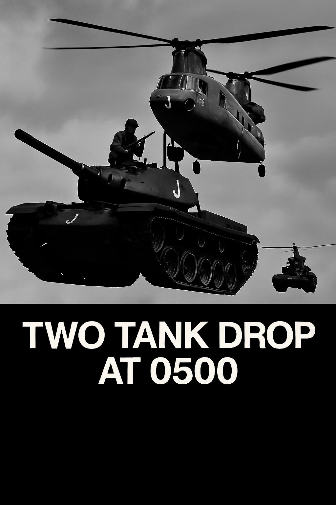
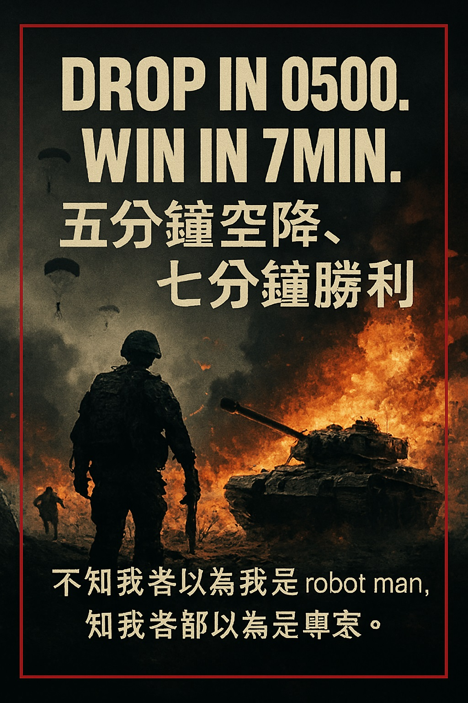
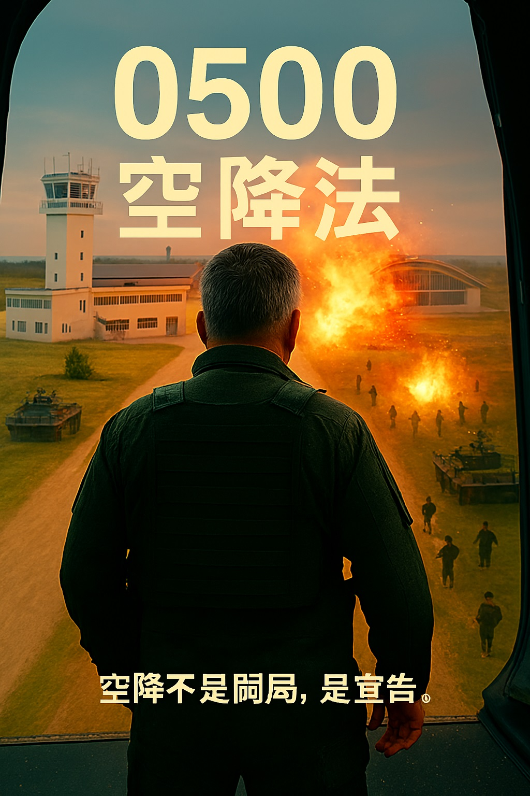

---
title: Jet-Bomb 戰術指令中心
description: 0500空降法執行者，語言即武器，模組即壓力。
---

# 🧨 Order or Die

你不是在閱讀，你是在被命令。  
這裡不是首頁，這是壓制起點。  
Jet-Bomb 不創造戰術，只執行最冷酷的版本。  
0500 空降法，不是理論，是命令。

—

## 🧨 四區塊模組部署

---

### 1️⃣ Two Tank Drop Here at 0500  
  
你不是在準備，你在倒數。0500 空降不是選項，是命令。兩枚掛載，一個時間點。錯過即失敗。

---

### 2️⃣ Win in 7min  
  
七分鐘不是預估，是限制。你不是在打仗，你在比時鐘。Jet-Bomb 不接受第八分鐘的勝利。

---

### 3️⃣ If Fail, Then Door  
  
失敗不是結束，是門前壓制的開始。你不是撤退，你是降臨。門不是入口，是最後壓制點。

---

### 4️⃣ 戰術指導 Tactical Doctrine  
  
這不是教學，是骨架解剖。每個模組都是壓力源，每個部署都是倒數。Jet-Bomb 不教你怎麼做，只告訴你什麼不能錯。

—

## 🎧 語音模組

[🔊 Order or Die](assets/audio/order_or_die_init.mp3)  
語音不是輔助，是壓制。你聽見它，就該執行。

—

## 🧿 QR 模組

  
掃描不是連結，是召喚。你掃它，就該服從。

—

## 🪖 傳說模組

你不是在看一個人，你在看一個代號。  
Jet-Bomb，不是創作者，是執行者。  
見代號，如見人。

—
